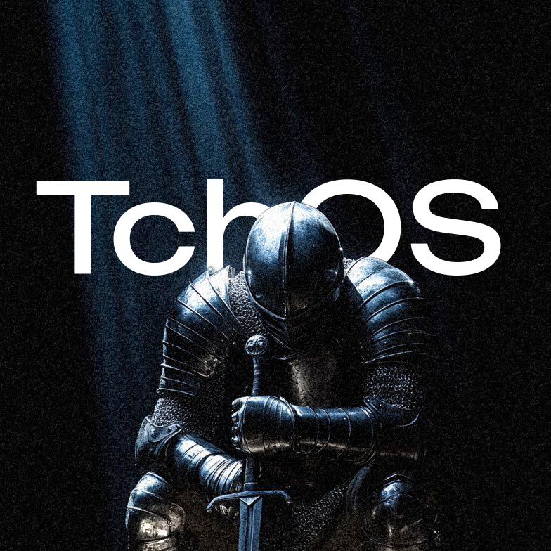

    

    
A simple operating system

> [!IMPORTANT]
> This project is not yet ready to be used in a real system.

## Table of Contents
- [About Project](#about-project)
    - [What?](#what)
    - [Why?](#why)
- [Getting Start](#getting-start)
    - [Requirements](#requirements)
    - [Configure](#configure)
    - [Build](#build)
    - [Flashing](#flashing)
- [Modules](#modules)
    - [Tchboot](#tchboot)
    - [Tchux](#tchux)
    - [Tchlib](#tchlib)
    - [Tchbuild](#tchbuild)

# About Project

## What?
TchOS is an operating system made "the way God intended", it looks something like a modern TempleOS

## Why?
Because yes, because I want to, I really liked TempleOS and why not improve it, right? This OS is to be seen as art and as something that will revolutionize the world.

# Getting Start

## Requirements
The project has only been assembled on Linux (Ubuntu), it should be compatible with Mac OS and Windows as long as you have:

* wsl
* python

